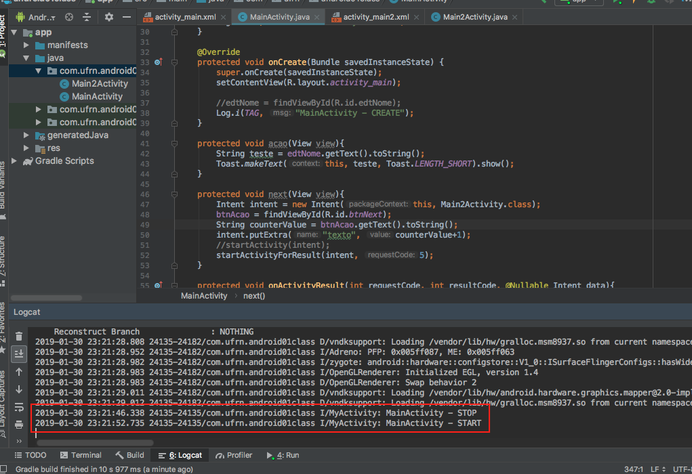

# Discipline: IMD0107 - Mobile Application Development - Prof. Emerson Moura de Alencar
## Student: Marco Olimpio
### Assignment 01 - Sending mesage back and forth through Activity

---
- Goals
  - Make use of LogCat
  - Starting from one, send this value between two Activity always incrementing the value, ie:
    - Activity 01 - Value 01
    - Activity 02 - Value 02
    - Activity 01 - Value 03
    - Activity 02 - Value 04
    - and so on...
- What will be observed?
  - The right use of communication between Activity 

# What have I done

The use of LogCat was made bu coding the ```Log.i()``` into events like ```onStart()```, ```onStop()``` and ```onCreate()```. This is the method to log your application and we could utilize some other methods besides ```i()```, for instance the method ```e()``` is intended to spaw log error mesages. Below we can notice the mesage in the LogCat view.



For the second point, we extended what we learned during the class and coded the mesage change between two activity not making use of any counter.

# Which device it was tested

It was tested in a Motorola G5s with Android 8.1
